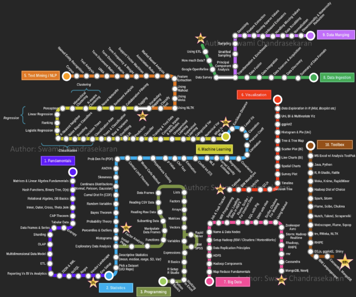

# Udacity_Blog_Project

Answers to Three Questions that will Keep You Optimistic in Your Journey of Becoming a Data Scientist.



## Table of Contents
1. [Description](#project_overview)
2. [Getting Started](#getting_started)
	1. [Dependencies](#dependencies)
	2. [Installing](#installing)
	3. [Results](#executing)
3. [Authors](#authors)
4. [License](#license)
5. [Acknowledgement](#acknowledgement)
6. [Publication](#published)

<a name="project_overview"></a>
## Project Overview

If you are an aspiring Data Scientist, then you probably came across the infamous road map (shown above). The number of skillsets to be considered a Data Scientist seems infinite. No wonder why Data Scientists earn huge salaries, right? Well this study is focused to put you at ease and give you an idea of what skillsets professionally working Data Scientist have and what skills they plan to acquire in the near future. The data analyzed in this study came from the StackOverflow’s Annual Developer Survey (2018). Nevertheless, this survey asked a series of questions to participants working with technology related fields as software developers, DevOps, Data Scientists, etc. For the purpose of this study I focused on the data from the Data Scientists’ responses to the survey. And I wanted to answer three main questions with it.


Questions
1) Which languages are current Data Scientists using? and what languages do they plan to learn in the near future?
2) Which frameworks are current Data Scientists using? and what frameworks do they plan to learn in the near future?
3) Based on the Data Scientists’ salaries and years of experience, what are the Data Scientists planning to learn? What frameworks are important to them which may lead to higher salaries or advancing in their career?
The answers to these questions are readily available with a little data munging and exploratory data analysis. I also have surprise for those aspiring to land their first Data Science job.

<a name="getting_started"></a>
## Getting Started

<a name="dependencies"></a>
### Dependencies
* Python 3, NumPy, plotly, matplotlib

<a name="installing"></a>
### Installing
Clone this GIT repository:
```
https://github.com/geovani-montoya/Udacity_Blog_Project
```
<a name="executing"></a>
### Conclusion:
We are all on the same boat :) Do not get discouraged if it seems overwhelming to learn every single thing. From the looks of it, the only way to get higher salaries is by experience. Data Science is truly a life long learning career; the old timers are still learning.


<a name="authors"></a>
## Authors

[Geovani Montoya](https://github.com/geovani-montoya)

<a name="license"></a>
## License
[](https://opensource.org/licenses/MIT)

<a name="acknowledgement"></a>
## Acknowledgements

* [Udacity](https://www.udacity.com/) extensive curriculum in Data Science Nanodegree Program
* StackOverflow for the dataset 

<a name="published"></a>
## Publication

https://medium.com/@geovani.m12/answers-to-three-questions-that-will-keep-you-optimistic-in-your-journey-of-becoming-a-data-824c6666d688?source=friends_link&sk=a5287af5d6cf158d0e3055214af646f0
